# Omnix — Lifestyle Tracking App

Omnix is a cross-platform lifestyle tracking application built with Flutter. It combines task management, habit tracking, and mood journaling into a single clean experience — backed by Supabase for cloud sync and authentication.

---

## Screenshots

| Splash Screen | Login | Today (Light) |
|:---:|:---:|:---:|
| 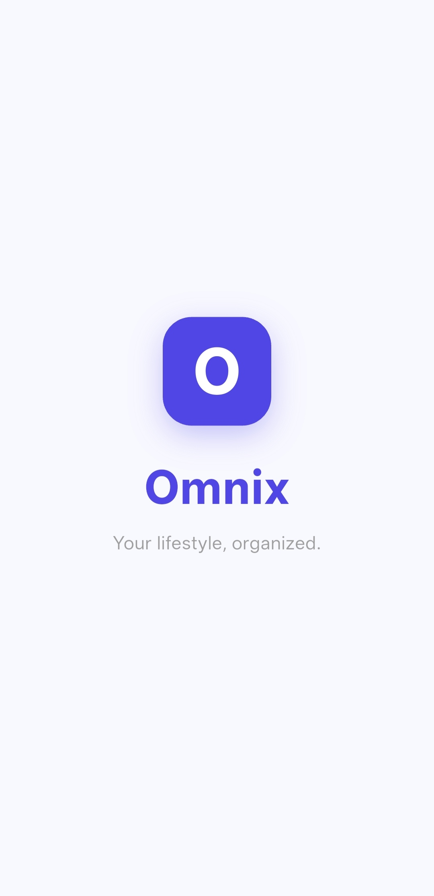 | 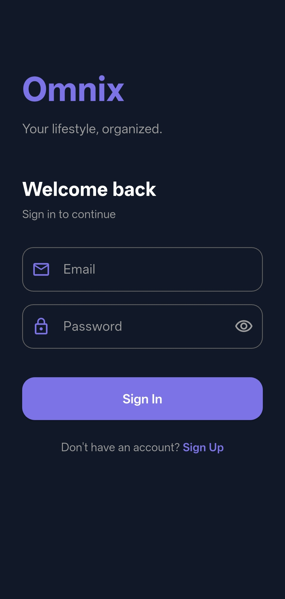 | 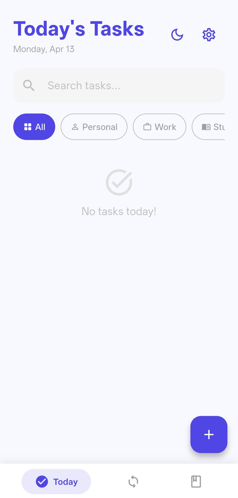 |

| Today (Dark) | Add Task | Habits |
|:---:|:---:|:---:|
| 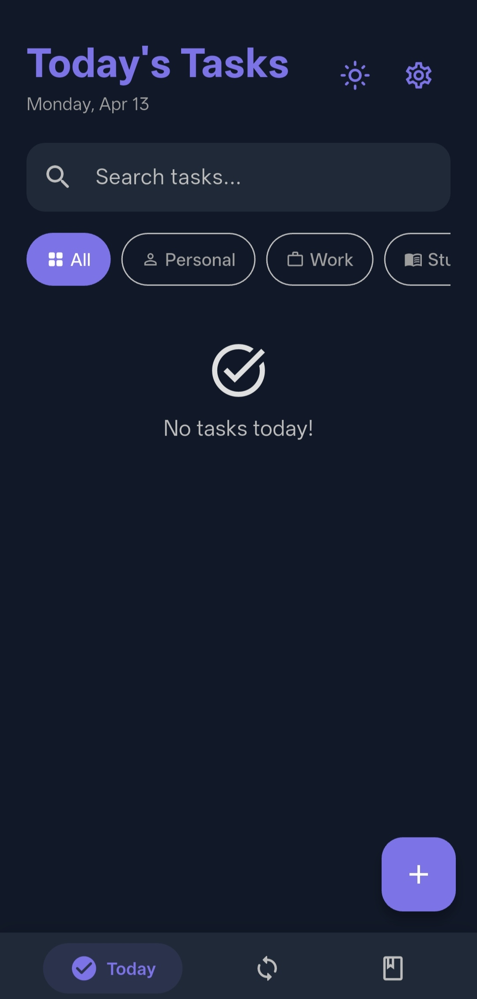 | 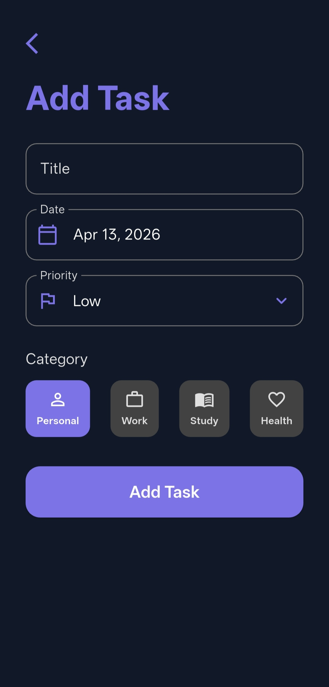 | 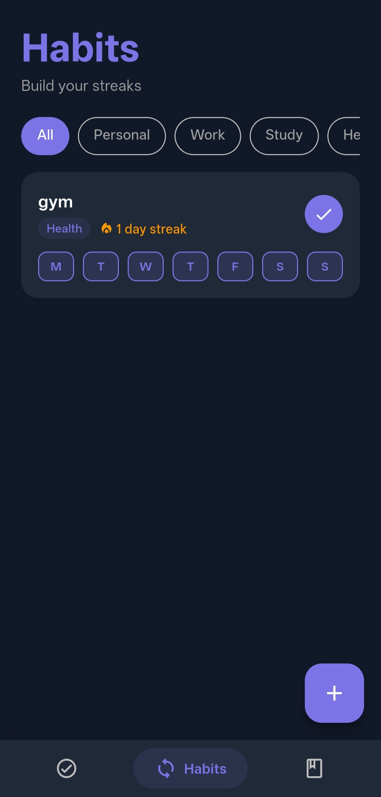 |

| Add Habit | Habit Detail | Journal Diary |
|:---:|:---:|:---:|
| 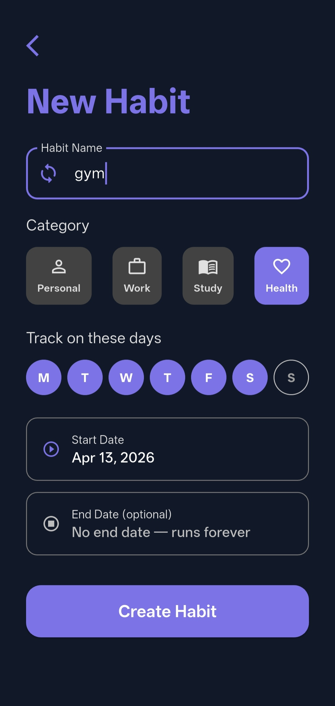 | 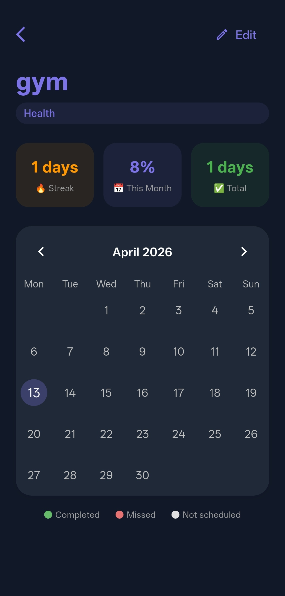 | 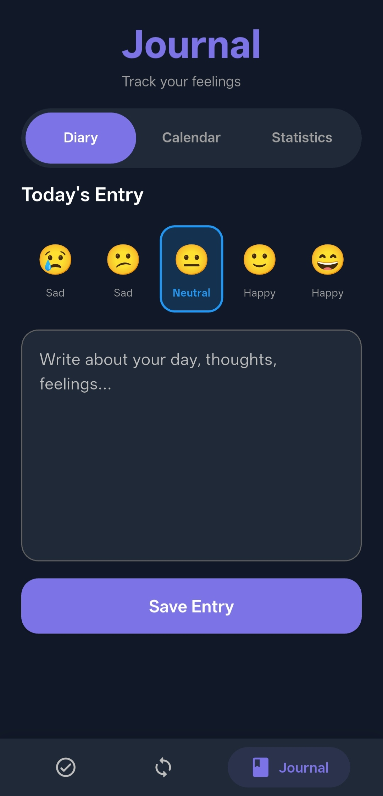 |

| Journal Calendar | Journal Statistics | Settings |
|:---:|:---:|:---:|
| 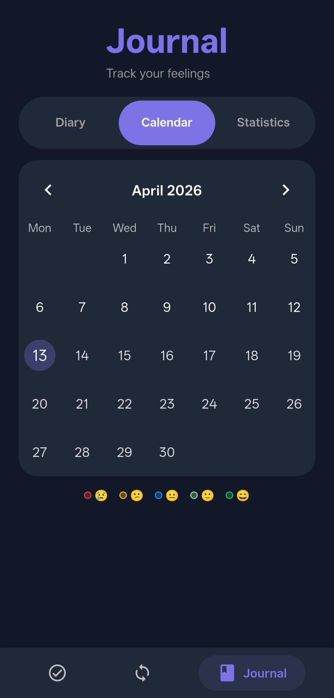 | 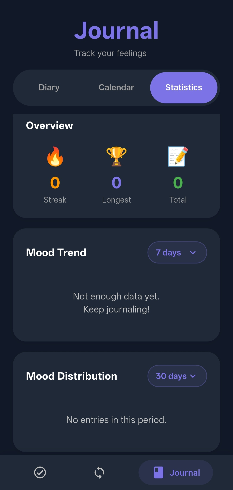 | 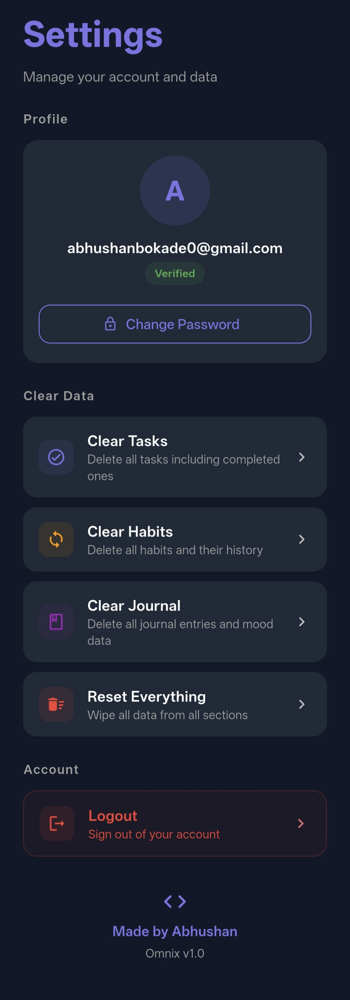 |

## Features

### Today's Tasks
- View tasks due today and overdue tasks
- Category filter (Personal, Work, Study, Health)
- Search tasks instantly
- Upcoming tasks collapsible section
- Priority color coding (High = Red, Medium = Orange, Low = Green)
- Overdue badge on past-due tasks

### Habit Tracking
- Create recurring habits with custom day selection (e.g. Mon/Wed/Fri only)
- Daily check-in with animated UI
- Streak counter with fire indicator
- Habit detail screen with monthly calendar
- Green = completed, Red = missed, Grey = not scheduled
- Completion % stats per month

### Mood Journal
- Write daily entries with mood tracking
- 5 moods: Very Sad 😢 / Little Sad 😕 / Neutral 😐 / Happy 🙂 / Very Happy 😄
- Calendar view with mood-colored dots per day
- Statistics tab with mood trend line chart and distribution bar chart
- Dropdown to filter charts by 7 / 15 / 30 / 90 days
- Add or edit entries for any past date

### Cloud Backend (Supabase)
- Email + password authentication
- Data synced to PostgreSQL via Supabase
- Row Level Security — each user only sees their own data
- Offline support via local SQLite cache
- Change password from settings

### UI/UX
- Light and dark mode with persistent theme preference
- Animated Omnix splash screen
- Pill-shaped tab navigation in journal
- Category chips with icon + label
- Modern card design with left border priority indicator

---

## Tech Stack

| Layer | Technology |
|---|---|
| Framework | Flutter (Dart) |
| Local Database | SQLite via `sqflite` |
| Cloud Backend | Supabase (PostgreSQL) |
| Authentication | Supabase Auth (JWT) |
| Calendar | `table_calendar` |
| Charts | `fl_chart` |
| Date Formatting | `intl` |
| Theme Persistence | `shared_preferences` |

---

## Architecture

```
lib/
├── main.dart                    # App entry, theme, auth routing
├── models/
│   ├── task_model.dart
│   ├── habit_model.dart
│   ├── habit_log_model.dart
│   └── journal_model.dart
├── helpers/
│   └── database_helper.dart     # SQLite CRUD operations
├── services/
│   ├── supabase_service.dart    # Auth helpers
│   └── sync_service.dart        # Cloud sync logic
└── screens/
    ├── auth/
    │   ├── login_screen.dart
    │   └── signup_screen.dart
    ├── home_screen.dart         # Today's tasks + habits
    ├── habits_screen.dart       # All habits list
    ├── habit_detail_screen.dart
    ├── add_habit_screen.dart
    ├── add_task_screen.dart
    ├── journal_screen.dart      # Diary + Calendar + Stats
    ├── splash_screen.dart
    └── settings_screen.dart
```

## Database Schema

### Local SQLite (`omnix3.db`)
- `tasks` — id, remote_id, title, date, priority, status, category
- `habits` — id, remote_id, name, category, days, start_date, end_date
- `habit_logs` — id, remote_id, habit_id, habit_remote_id, date, completed
- `journal_entries` — id, remote_id, date, content, mood

### Cloud Supabase (PostgreSQL)
- Same schema with `user_id` UUID column for RLS isolation

---

## Getting Started

**Prerequisites:**
- Flutter SDK (3.41+)
- Android Studio / VS Code
- Android device or emulator

**Steps:**
```bash
git clone https://github.com/Abhushan187/Omnix-.git
cd Omnix-
flutter pub get
flutter run
```